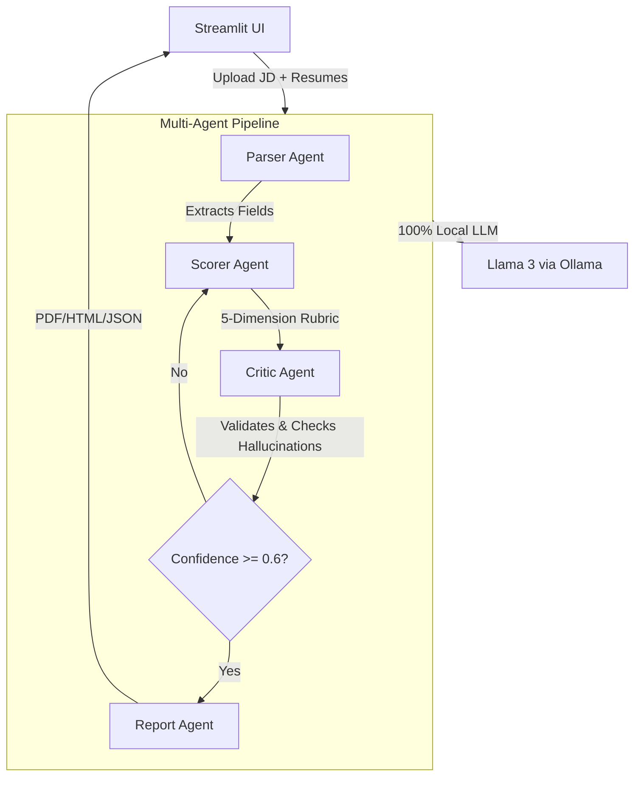

# HR Resume Shortlisting Agent 

## AI-Powered Candidate Evaluation · Skills Gap Analysis · Bias Detection

**LLM:** Llama 3 (Ollama, Local)
**Framework:** LangGraph
**UI:** Streamlit
**Task:** Task 1 — HR Resume & LinkedIn Shortlisting Agent

---

## Quick Start

### Prerequisites
- Python 3.10+
- [Ollama](https://ollama.com) installed with Llama 3

### Setup
```bash
# 1. Pull Llama 3
ollama pull llama3

# 2. Clone and install
cd "hr, resume shortlister"
python -m venv venv
venv\Scripts\activate        # Windows
pip install -r requirements.txt

# 3. Configure environment
copy .env.example .env       # Edit if needed

# 4. Run
streamlit run app.py
```

---

## Architecture

### Agent Architecture Diagram



The Critic Agent can loop back to Scorer if confidence < 0.6 (max 2 retries).

---

## Features

### Core
1. **JD Parser** — Extracts skills, experience, qualifications from any JD
2. **Resume Ingestion** — PDF and DOCX batch processing (50+ files)
3. **Semantic Scoring** — 5 weighted dimensions with LLM reasoning
4. **Ranked Shortlist** — PDF/HTML/JSON reports with scores and justifications
5. **Human Override** — Adjust scores with reason; all changes audit-logged

### Bonus Additions
1. **Skills Gap Analysis** — Matched/Missing/Bonus skills with learning resource links
2. **Bias Detection Layer** — PII anonymisation before scoring + fairness audit
3. **Multi-Agent Architecture** — 4 specialised agents in a LangGraph state graph
4. **Critic Agent** — Validates scores, catches hallucinations, triggers re-scoring
5. **Langfuse Observability** — Trace every LLM call (optional)

### Rich Visualizations (Streamlit)
- 📊 **Radar Charts** — Compare candidates across 5 dimensions
- 🏆 **Ranking Bar Charts** — Color-coded by recommendation
- 🔥 **Score Heatmap** — All candidates × all dimensions
- 📈 **Gauge Charts** — Individual candidate score dials
- 🧩 **Skills Gap Charts** — Matched vs Missing vs Bonus bars

---

## Scoring Rubric

| Dimension | Weight | 0 — Poor | 5 — Average | 10 — Excellent |
|---|---|---|---|---|
| Skills Match | 30% | <30% match | 50–70% match | >85% match |
| Experience Relevance | 25% | Unrelated domain | Adjacent domain | Exact domain & seniority |
| Education & Certs | 15% | Below minimum | Meets minimum | Exceeds + extra certs |
| Projects / Portfolio | 20% | No evidence | 1–2 generic projects | Strong relevant portfolio |
| Communication Quality | 10% | Poor grammar | Adequate clarity | Crisp and impactful |

**Recommendation thresholds:** ≥75 = Hire, 50–74 = Maybe, <50 = No Hire

---

## LLM & Framework

- **LLM: Llama 3 (via Ollama)**
  - **Rationale:** Using Ollama to host Llama 3 locally ensures no PII (Personally Identifiable Information) from candidate resumes ever leaves the host machine. Llama 3 is highly performant for extraction and reasoning tasks while remaining computationally feasible for local execution.
- **Framework: LangGraph**
  - **Rationale:** Candidate evaluation fundamentally requires cyclic reasoning to be accurate. The Critic Agent needs the ability to review the Scorer Agent's output and force a re-evaluation (looping back) if hallucinations or score inconsistencies are detected. LangGraph models this perfectly as a state machine / graph, which is difficult to achieve cleanly with linear frameworks like standard LangChain.
- **UI: Streamlit**
  - **Rationale:** Streamlit enables the rapid creation of an interactive dashboard with built-in charting and seamless Python backend integration, allowing HR professionals to visualize skills gaps and execute overrides effortlessly without requiring a complex full-stack web setup.

## Tech Stack

| Layer | Tool |
|---|---|
| LLM | Llama 3 8B (Ollama, local) |
| Agent Framework | LangGraph 0.2.x |
| UI | Streamlit |
| Resume Parsing | PyMuPDF + python-docx |
| PDF Reports | ReportLab |
| HTML Reports | Jinja2 |
| Charts | Plotly |
| Database | SQLite + SQLAlchemy |
| Observability | Langfuse (optional) |

---

## Project Structure

```
├── app.py                    # Streamlit UI (entry point)
├── requirements.txt
├── .env.example
├── SECURITY.md
├── agents/
│   ├── graph.py              # LangGraph state graph
│   ├── parser_agent.py       # JD + Resume extraction
│   ├── scorer_agent.py       # 5-dimension rubric scoring
│   ├── critic_agent.py       # Validation + hallucination check
│   └── report_agent.py       # Report generation + skills gap
├── models/
│   ├── schemas.py            # Pydantic data models
│   └── database.py           # SQLite ORM
├── services/
│   ├── file_parser.py        # PDF/DOCX extraction
│   ├── linkedin_parser.py    # LinkedIn JSON ingestion
│   ├── bias_detector.py      # PII anonymisation + fairness
│   ├── skills_gap.py         # Gap analysis + learning paths
│   └── report_generator.py   # PDF/HTML/JSON output
├── prompts/                  # System prompts for all agents
├── templates/
│   └── report.html           # Jinja2 HTML report template
├── tests/
│   └── sample_data/          # Test JD + resumes + LinkedIn JSON
└── output/                   # Generated reports
```

---

## Security Mitigations

See [SECURITY.md](SECURITY.md) for full details.

| Risk | Mitigation |
|---|---|
| Prompt Injection | Input sanitisation, system prompt hardening |
| Data Privacy | 100% local (Ollama), PII anonymisation |
| API Key Exposure | .env + .gitignore |
| Hallucination | Critic Agent validation, confidence thresholds |
| Bias | Anonymised scoring, fairness audit |

---
